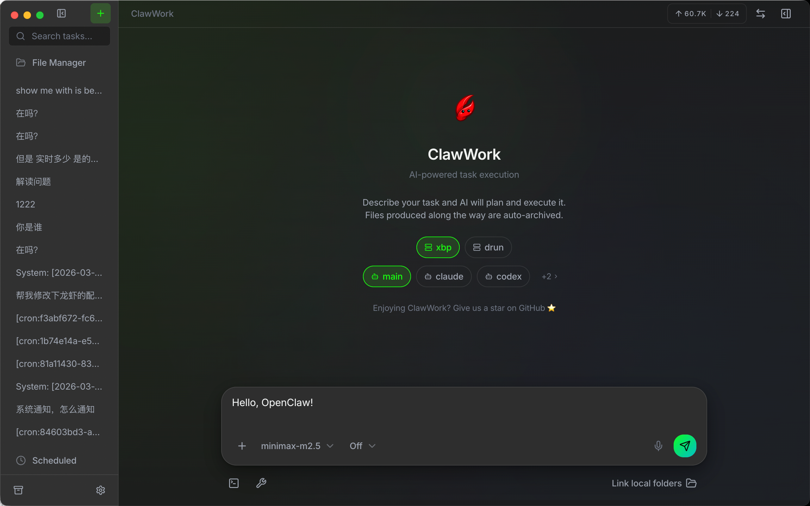

<div align="center">



# ClawWork

**A desktop workspace for [OpenClaw](https://github.com/openclaw/openclaw).**

Parallel tasks, visible tool activity, and files you can actually find later.

[](https://github.com/clawwork-ai/clawwork/releases/latest)
[](LICENSE)
[](https://github.com/clawwork-ai/clawwork)

[Download](#download) · [Quick start](#quick-start) · [Why ClawWork](#why-clawwork) · [What you get](#what-you-get) · [Roadmap](#roadmap) · [Contributing](#contributing)

</div>

## Why ClawWork

Using OpenClaw through Telegram, Slack, or a plain chat UI works fine for small stuff. It gets annoying once the work stops being simple.

Status disappears into the message stream. Running several tasks means juggling tabs and trying to remember which session was using which model. Files show up in replies, then vanish into history.

ClawWork fixes that by treating each task as its own workspace. You get a desktop UI where tasks stay separate, tool activity is visible while it happens, and output files stay attached to the work that produced them.

## Why it feels better

- Each task runs in its own OpenClaw session, so you can switch between parallel jobs without mixing context.
- Streaming replies, tool call cards, progress, and artifacts live in one place instead of being buried in chat history.
- Gateway, agent, model, and thinking settings are scoped per task.
- Files produced by the agent are saved to a local workspace and stay easy to browse later.
- Risky exec actions can stop for approval before they run.

## Download

### Homebrew (macOS)

```bash
brew tap clawwork-ai/clawwork
brew install --cask clawwork
```

### Releases

Prebuilt macOS and Windows builds are available on the [Releases page](https://github.com/clawwork-ai/clawwork/releases/latest).

If macOS blocks first launch because the app is unsigned:

```bash
sudo xattr -rd com.apple.quarantine "/Applications/ClawWork.app"
```

## Quick start

1. Start an OpenClaw Gateway.
2. Open ClawWork and add a gateway in Settings. The default local endpoint is `ws://127.0.0.1:18789`.
3. Create a task, pick a gateway and agent, and describe the work.
4. Add images, `@` file context, or slash commands if you need them.
5. Follow the task as it runs, inspect tool activity, and keep the output files.

## What you get

### Task-first workflow

- Parallel tasks with isolated OpenClaw sessions
- Per-gateway session catalogs
- Session stop, reset, compact, and delete actions
- Background work that stays readable instead of collapsing into one long thread

### Better visibility

- Streaming responses in real time
- Inline tool call cards while the agent works
- Progress and artifacts in a side panel
- Usage, token, and cost tracking per session

### Better control

- Multi-gateway support
- Per-task agent and model switching
- Thinking level controls and slash commands
- Approval prompts for sensitive exec actions

### Better file handling

- Image messages and `@` file context
- Session-bound folder context
- Local artifact storage
- Full-text search across tasks, messages, and artifacts

### Better desktop ergonomics

- System tray support
- Quick-launch window with a global shortcut
- Keyboard shortcuts throughout the app
- Local voice input with [whisper.cpp](https://github.com/ggerganov/whisper.cpp)
- Light and dark themes, plus English and Chinese UI

## How it works

ClawWork talks to OpenClaw through the Gateway WebSocket API. Each task gets its own session key, which keeps concurrent work isolated. The desktop app stores task metadata, messages, and artifact indexes locally so you can search and revisit work without digging through chat logs.

```text
┌──────────────────────┐        WebSocket         ┌──────────────────────┐
│  ClawWork Desktop    │ ◄──────────────────────► │  OpenClaw Gateway    │
│                      │                          │                      │
│  Task A              │   chat.send             │  Agent runtime        │
│  Task B              │   chat stream           │  Session manager      │
│  Task C              │   tool events           │  Parallel sessions    │
│                      │   approval requests     │                      │
│  React UI            │                          │                      │
│  SQLite index        │   route by sessionKey   │                      │
│  Local workspace     │                          │                      │
└──────────────────────┘                          └──────────────────────┘
```

## Roadmap

Already shipping:

- Multi-task parallel execution
- Multi-gateway support
- Tool call cards and approval dialogs
- Slash commands and thinking controls
- File context attach and artifact browsing
- Usage and cost dashboard
- Tray support and quick launch
- Local voice input

Next up:

- Linux packages
- Conversation branching
- Artifact diff view
- Desktop notifications for background completions
- Custom themes

## Contributing

The project is early and moving fast. If you want to help:

- Read [DEVELOPMENT.md](DEVELOPMENT.md) for setup and project structure
- Check [Issues](https://github.com/clawwork-ai/clawwork/issues)
- Open a [Pull Request](https://github.com/clawwork-ai/clawwork/pulls)

## License

[Apache 2.0](LICENSE)

<div align="center">

Built for [OpenClaw](https://github.com/openclaw/openclaw).

</div>
